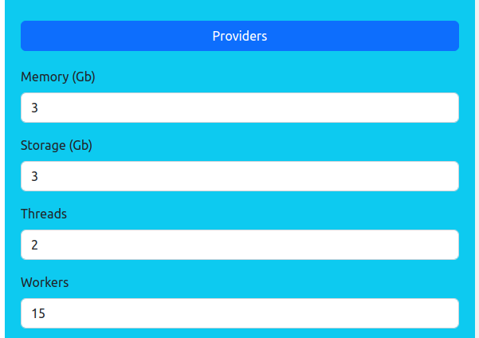

<h1 align="center">Golem Blender Render</h1>

The purpose of this repository is to provide a decentralized tool to render your Blender projects.

This Web application run on top of Golem Network.  
Frames will be rendered on remote providers selected by hardware ressources and prices.

Current limitation concerns compositing (specificaly Render-Layer node).  
If your design contains compositing you will need to use providers with GPU, else compositing will be disabled.

This repository contains two Blender project in blender_project_examples directory as examples:  

- 010_0020_A (010_0020_A.lighting, no compositing)
- blender-benchmark-class-room (classroom.blend, with compositing)

In order to run this application you will need an Polygon wallet with few MATIC and GLM.  
Simplest way of creation is with Metamask.

Private key must be exported as environment variable:

- Linux:
``` 
	export PK=your-private-key
``` 
- Windows:
``` 
	set PK=your-private-key
``` 

Steps 2 & 3 are optional.

**1] Clone repository**
``` 
	git clone https://github.com/norbibi/Golem_Blender_Render.git
	cd Golem_Blender_Render
``` 
**2] Build GVMI**
``` 
	./build_gvmi.sh
``` 
**3] Build docker image**
``` 
	docker build -t maugnorbert/golem_blender_render:latest Docker_Golem_Blender_Render
``` 
**4] Run Golem Blender Render**

- Linux:
``` 
	docker run --rm -ti -e PK=$PK -p 3000:3000 -p 3001:3001 -p 8000:8000 -v $(pwd)/outputs:/home/golem/app/server/outputs maugnorbert/golem_blender_render
``` 
- Windows:
``` 
	docker run --rm -ti -e PK=%PK% -p 3000:3000 -p 3001:3001 -p 8000:8000 -v %CD%/outputs:/home/golem/app/server/outputs maugnorbert/golem_blender_render
``` 
**5] How to use**

In your browser go to http://localhost:3000 and  configure your render job:

><details>
><summary>Providers</summary>  
>
>- Select hardware ressources of providers (threads, RAM, storage).
>- Specify how many workers you want to use.
>- Select GPU if needed/wanted.
><p align="center">
>	 
></p>
></details>
>
><details>
><summary>Budget, Prices & Payment</summary>
>	
>- Set the maximum budget you allow for this job (job will be cancelled if reached).
>- If enable, set the payment interval you allow.
>- Set your maximum prices (start, thread & env).
><p align="center">
>	 
></p>
></details>
>
><details>
><summary>Timeouts</summary>
>	
>- Set your global timeout (time needed that you estimate to render all frames, job will be cancelled if reached).
>- Set your upload timeout (time to upload your design to providers, it depends on provider's internet link quality).
>- Set your render timeout (time to render one frame, it depends on provider's ressources and design complexity).
><p align="center">
>	 
></p>
></details>
>
><details>
><summary>Project</summary>
>	
>- Select your project folder.
>- Select main blend file of your project.
>- Select frames to render with the slide range.
><p align="center">
>	 
></p>
></details>

Click run & wait :blush:

**6] Notes:**

- Refreshing page abort current render job (if running).  
- Global timeout above 5h enable mid-agreement wich seems to have a bug, so don't use for the moment.  
- Your project frames (and Yagna log file) will be available in a subfolder (named and timestamped) of outputs directory.  
- Polygon fees are proportional to the number of workers involved and upload time can be (very) long, so set number of providers as a fraction of number of frames (example: 15 providers for 145 frames).
